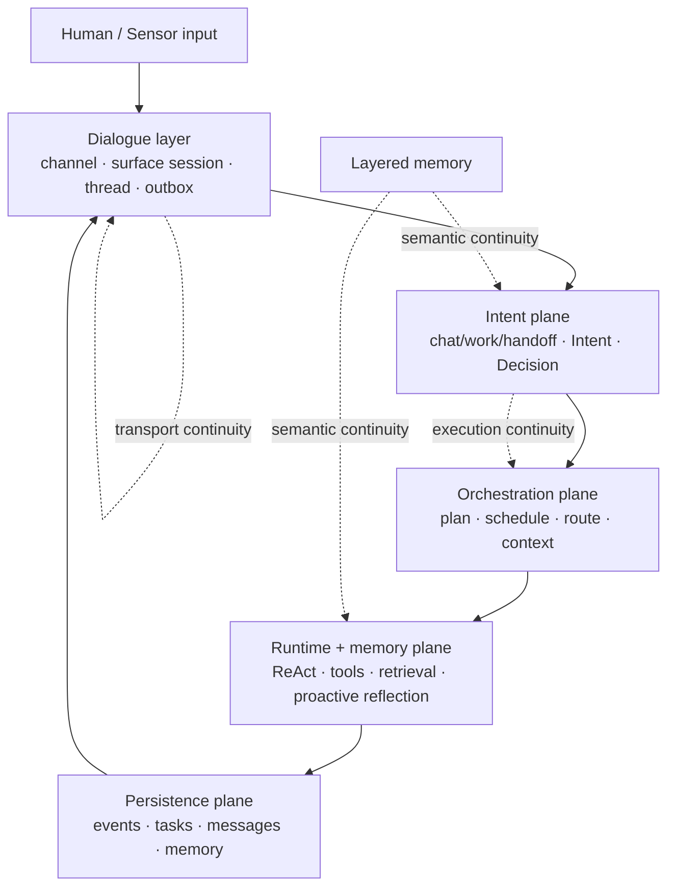

[简体中文 README](./README.md)

# Nous

**A local-first, persistent personal-assistant runtime for autonomous agents.**

Nous is not trying to be “a chat UI with tools.” It is trying to become a **long-lived assistant runtime** that can carry identity, memory, initiative, execution, and governed continuity across terminals, threads, and future surfaces.

> *Nous (νοῦς) — the active intellect that organizes chaos into order.*

## What Nous is trying to build

### North Star

Nous should ultimately become a **self-evolving collective intelligence in service of human welfare**.

### Current architectural center

Right now, Nous is intentionally centered on a narrower but more concrete product truth:

> **one persistent, proactive, local-first personal assistant runtime for one human first**

That means:

- long-lived daemon instead of one-shot command execution
- explicit work governance instead of “hope the last few messages are enough”
- layered memory instead of stateless prompt stuffing
- proactive reflection instead of purely reactive task intake
- local policy / permission / secret boundaries instead of invisible cloud-side control

## Why Nous is different

Most agent frameworks optimize for one of these things:

- prompt-and-tool loops
- multi-agent orchestration
- IDE productivity
- channel routing

Nous is trying to combine those with a stronger operating model:

1. **Daemon-first persistence**
   Work continues even when the terminal closes.

2. **Governed work objects**
   Mainline architecture uses **Intent → Plan → Task → Decision** rather than collapsing all work into one chat thread.

3. **Memory as semantic continuity**
   Threads own replay and delivery; memory increasingly owns “what is this actually related to?” via layered retrieval and the emerging `RecallPack` direction.

4. **Proactive cognition**
   Nous includes perception, agenda-driven reflection, prospective commitments, and governed proactive candidate delivery.

5. **Local-first governance**
   Permission boundaries, file-backed secrets, daemon state, and message persistence all stay local by default.

6. **Evolution path**
   Nous is designed to grow from execution traces into validated procedures, better tools, and eventually broader collective intelligence.

## Architecture in one screen

Nous is organized as a layered runtime rather than a single monolithic agent loop:

- **Dialogue layer** — channels, surface sessions, dialogue threads, replay, outbox delivery
- **Intent plane** — interaction mode classification, intent formation, decision gating
- **Orchestration plane** — planning, scheduling, routing, context assembly
- **Runtime + memory plane** — ReAct execution, tool system, retrieval, proactive reflection
- **Persistence plane** — event/task/message/memory storage
- **Infrastructure plane** — daemon, sensors, channel adapters, observability

Three forms of continuity are explicitly separated in current mainline architecture:

- **transport continuity** → channel / thread / outbox / replay
- **execution continuity** → Intent / Plan / Task / Decision
- **semantic continuity** → layered memory / retrieval / `RecallPack`

This split is one of the central current design decisions in the repo.



## Why this is not just another agent framework

| Dimension | Generic chat+tools agent | Nous |
|---|---|---|
| Runtime model | foreground session | long-lived daemon runtime |
| Continuity model | keep recent turns and hope | transport / execution / semantic continuity split |
| Work model | message-centric | `Intent -> Plan -> Task -> Decision` |
| Memory role | prompt context helper | semantic continuity authority moving toward `RecallPack` |
| Proactivity | optional notification logic | perception + agenda + reflection + governed candidate delivery |
| Governance | often implicit | explicit permissions, decisions, pause/resume/cancel, outbox replay |
| Product center | chatbot / coding copilot / orchestration tool | persistent personal assistant first |

Another way to say it:

- **Codex / Claude Code** are excellent foreground work sessions
- **OpenClaw** is strong at multi-surface gateway/session routing
- **Nous** is trying to fuse OS-grade substrate + governed work + semantic continuity backed by memory governance + proactive assistant behavior

That does make Nous architecturally heavier than a thin tool-calling loop. That is intentional.

## Current status

Nous is no longer only an architecture document. The current local-first runtime slice is real.

### Already materially implemented

- persistent daemon + CLI / REPL attach path
- dialogue threads + outbox replay + reconnect delivery
- interaction-mode split (`chat` / `work` / `handoff`)
- work governance with clarification / decision / pause / resume / cancel flows
- scope-aware context assembly
- semantic-hybrid memory retrieval substrate
- prospective memory seed + proactive agenda / reflection runtime seed
- file-backed permission boundary + secret boundary
- procedure / evolution seed
- governed inter-Nous procedure-summary exchange seed

### Strongest current product truth

If you want to understand Nous **today**, the best summary is:

> **a continuing assistant for local technical work, with daemon persistence, work governance, memory substrate, and the beginnings of real proactive behavior**

### Still actively under construction

- deeper `RecallPack`-style semantic continuity in live code
- removing the remaining `WorkItem*` compatibility naming from active docs and APIs
- relationship-aware proactive runtime
- richer tool breadth
- stronger vector / graph / metabolism memory path
- broader multi-surface clients beyond the CLI-first path

## Quick start

### Requirements

- [Bun](https://bun.sh/)
- macOS / Linux recommended for the current daemon-first local workflow
- an OpenAI-compatible model endpoint for the current default provider path

### Install dependencies

```bash
bun install
```

### Sanity-check the workspace

```bash
bun run typecheck
bun run test
```

### Start the daemon locally

From the repo:

```bash
bun bin/nous.ts daemon start
```

If you have installed / linked the CLI globally, the equivalent is:

```bash
nous daemon start
```

### Submit work

```bash
bun bin/nous.ts "Read the README and summarize the architecture"
```

### Enter the REPL

```bash
bun bin/nous.ts
```

Useful commands:

```bash
bun bin/nous.ts status
bun bin/nous.ts attach <threadId>
bun bin/nous.ts debug daemon
bun bin/nous.ts debug thread <threadId>
```

See [`docs/CLI.md`](./docs/CLI.md) for the current control surface.

## Provider setup

The recommended default provider path is currently **direct OpenAI**.

You can configure credentials via:

- `OPENAI_API_KEY`, or
- `~/.nous/secrets/providers.json`

Direct OpenAI endpoints can be customized via:

- `OPENAI_API_BASE_URL`
- `OPENAI_BASE_URL` (alias)

For explicit OpenAI-compatible proxy / local gateway setups, use:

- `OPENAI_COMPAT_BASE_URL`

## Runtime home

Nous uses `~/.nous` as its default user-level home directory.

Typical layout:

```text
~/.nous/
  config/         # JSON config files
  daemon/         # socket / pid / daemon state
  state/          # sqlite database
  logs/           # runtime logs
  artifacts/      # exported bundles / reports / snapshots
  network/        # instance identity + governed exchange bundles
  tools/          # evolved or user-provided tools
  skills/         # skill assets
  secrets/        # file-backed provider secrets
```

Project-local overrides can live in:

```text
<project>/.nous/
```

## Local E2E harness

For real daemon socket verification outside restricted sandboxes:

```bash
python3 scripts/e2e_daemon.py demo
```

For a single attached connection that receives daemon push messages:

```bash
python3 scripts/e2e_daemon.py live
```

You can also point it at a compiled or installed binary:

```bash
python3 scripts/e2e_daemon.py --nous-cmd "~/.local/bin/nous" demo
```

## Repository map

```text
bin/
  nous.ts         # CLI entry

packages/
  core/           # domain types: Intent / Task / Agent / Memory / protocol
  orchestrator/   # work intake, planning, scheduling, routing
  runtime/        # agent runtime, tool system, memory, proactive reflection
  persistence/    # sqlite stores for events, tasks, messages, memory, proactive state
  infra/          # daemon, CLI, channel glue, config, control surface
```

> Note: a few compatibility traces from the short-lived `WorkItem` naming experiment may still appear in history/docs, but active architecture and code now converge back on `Intent`.

## Inter-Nous seed commands

Minimal governed exchange is already available through the CLI:

```bash
nous network status
nous network enable
nous network procedures
nous network export <fingerprint>
nous network import <bundlePath>
nous network log
```

The current V1 exchange unit is a **validated procedure summary**.
This is intentionally narrower than the future relay / P2P architecture: V1 proves identity, policy, and governed artifact exchange before full networking arrives.

## Read next

- [`ARCHITECTURE.md`](./ARCHITECTURE.md) — full architecture and roadmap
- [`docs/INTENT_CONTINUITY_CONVERGENCE.md`](./docs/INTENT_CONTINUITY_CONVERGENCE.md) — current intent/continuity convergence decision
- [`docs/CONTINUITY_RUNTIME_WALKTHROUGH.md`](./docs/CONTINUITY_RUNTIME_WALKTHROUGH.md) — detailed chat/work/handoff + continuity runtime walkthrough
- [`docs/CLI.md`](./docs/CLI.md) — CLI / REPL control surface
- [`docs/DEVELOPMENT_LOG.md`](./docs/DEVELOPMENT_LOG.md) — engineering trace
- [`docs/PROGRESS_MATRIX.md`](./docs/PROGRESS_MATRIX.md) — current maturity / roadmap snapshot
- [`docs/V1_PLAN.md`](./docs/V1_PLAN.md) — finish-line planning

## License

MIT
