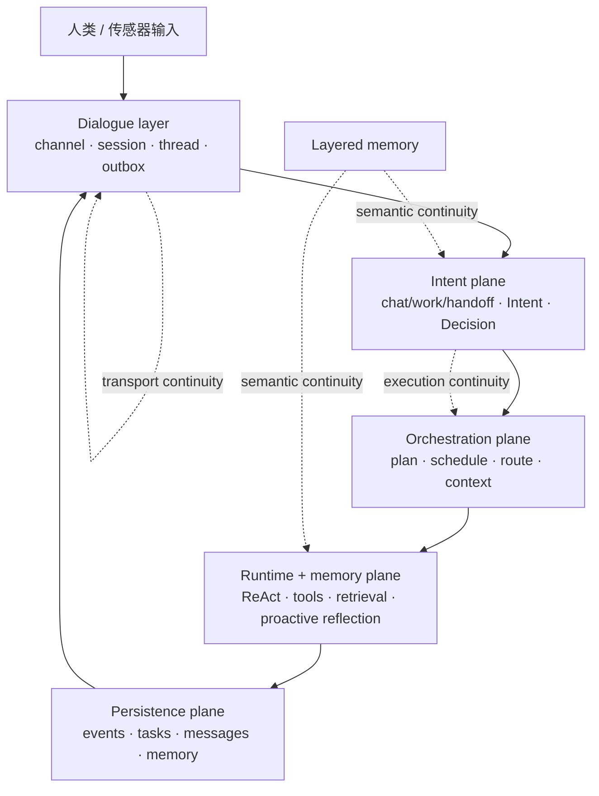

[English README](./README.en.md)

# Nous

**一个面向自治 Agent 的、本地优先、可持续存在的个人助理运行时。**

Nous 不是“带工具的聊天界面”。它试图成为一个**长期存在的助理运行时**: 能跨终端、跨线程、跨后续交互面持续携带身份、记忆、主动性、执行能力与受治理的连续性。

> *Nous (νοῦς) 指主动理智: 把混沌组织成秩序。*

## Nous 在构建什么

### 北极星

Nous 的长期目标是成为一个**服务于人类福祉的、自我进化的群体智能**。

### 当前架构中心

但在今天，Nous 仍然有一个更收敛、也更真实的产品核心:

> **先为一个具体的人，构建一个持续存在、主动工作、本地优先的个人助理运行时。**

这意味着：

- 它首先是长期运行的 daemon，而不是一次性命令行调用
- 它强调明确的工作治理，而不是“把最近几轮对话塞进上下文”
- 它需要分层记忆，而不是无状态 prompt stuffing
- 它追求真正的主动性，而不只是被动接任务
- 它把本地权限、配置、密钥和运行时状态视为一等公民

## 为什么 Nous 不一样

很多 agent 框架会在以下方向上做得很强：

- prompt + tool loop
- 多 agent 编排
- IDE 协作
- channel / session 路由

Nous 想要把这些能力建立在更强的运行时模型上：

1. **Daemon-first 持续性**
   终端关掉以后，工作仍然能继续。

2. **受治理的工作对象**
   主线架构不是把一切都塞进聊天线程，而是围绕 **Intent -> Plan -> Task -> Decision** 组织工作。

3. **以语义连续性为目标的记忆**
   线程负责回放和交付；记忆越来越多地负责“这件事真正和什么相关”，并朝 `RecallPack` 方向演进。

4. **主动认知**
   Nous 不只响应用户输入，还包含感知、议程驱动的反思、前瞻性承诺与受治理的主动候选输出。

5. **本地优先治理**
   权限边界、文件型密钥、daemon 状态与消息持久化默认都留在本地。

6. **持续进化路径**
   Nous 不是把执行结果丢掉，而是希望从执行轨迹里沉淀出经过验证的流程、工具与更高层能力。

## 一屏理解架构

Nous 是一个分层运行时，而不是单一的 agent loop：

- **Dialogue layer**: 渠道、会话、线程、回放、消息投递
- **Intent plane**: 交互模式分类、意图形成、决策门控
- **Orchestration plane**: 计划、调度、路由、上下文装配
- **Runtime + memory plane**: ReAct 执行、工具系统、检索、主动反思
- **Persistence plane**: event / task / message / memory 存储
- **Infrastructure plane**: daemon、传感器、channel 适配层、可观测性

当前主线架构明确把连续性拆成三层：

- **transport continuity**: channel / thread / outbox / replay
- **execution continuity**: Intent / Plan / Task / Decision
- **semantic continuity**: 分层记忆 / 检索 / `RecallPack`



## 当前状态

Nous 已经不只是架构文档，当前本地优先运行时的核心切片已经成型。

### 已经有真实实现的部分

- 持续运行的 daemon + CLI / REPL attach 路径
- dialogue threads + outbox replay + reconnect delivery
- `chat` / `work` / `handoff` 交互模式拆分
- clarification / decision / pause / resume / cancel 治理流程
- scope-aware context assembly
- 语义混合检索基座
- prospective memory seed + proactive agenda / reflection runtime seed
- 文件型 permission boundary 与 secrets boundary
- procedure / evolution seed
- 受治理的 inter-Nous procedure-summary exchange seed

### 今天最准确的产品描述

> **一个面向本地技术工作的持续型助理，具备 daemon 持续性、工作治理、记忆基座，以及初步的真正主动性。**

### 仍在持续建设中的方向

- 更深的 `RecallPack` 式语义连续性
- 清理剩余的 `WorkItem*` 兼容命名痕迹
- relationship-aware proactive runtime
- 更丰富的工具面
- 更强的向量 / 图 / metabolism 记忆路径
- 超越 CLI-first 的多表面客户端

## 快速开始

### 环境要求

- [Bun](https://bun.sh/)
- 推荐 macOS / Linux，用于当前 daemon-first 的本地工作流
- 一个 OpenAI-compatible 的模型端点

### 安装依赖

```bash
bun install
```

### 基础校验

```bash
bun run typecheck
bun run test
```

### 本地启动 daemon

```bash
bun bin/nous.ts daemon start
```

如果已经全局安装 / link：

```bash
nous daemon start
```

### 提交任务

```bash
bun bin/nous.ts "Read the README and summarize the architecture"
```

### 进入 REPL

```bash
bun bin/nous.ts
```

常用命令：

```bash
bun bin/nous.ts status
bun bin/nous.ts attach <threadId>
bun bin/nous.ts debug daemon
bun bin/nous.ts debug thread <threadId>
```

更多控制面请看 [`docs/CLI.md`](./docs/CLI.md)。

## Provider 配置

当前推荐的默认 provider 路径是**直连 OpenAI**。

可以通过以下方式配置凭据：

- `OPENAI_API_KEY`
- `~/.nous/secrets/providers.json`

可选环境变量：

- `OPENAI_API_BASE_URL`
- `OPENAI_BASE_URL`（别名）
- `OPENAI_COMPAT_BASE_URL`

## Runtime Home

Nous 默认使用 `~/.nous` 作为用户级运行时目录：

```text
~/.nous/
  config/         # JSON 配置
  daemon/         # socket / pid / daemon state
  state/          # sqlite 数据库
  logs/           # 运行日志
  artifacts/      # 导出产物 / 报告 / 快照
  network/        # 实例身份 + 受治理交换产物
  tools/          # 演化出的工具或用户自定义工具
  skills/         # skill 资源
  secrets/        # provider 密钥
```

项目级覆盖可以放在：

```text
<project>/.nous/
```

## 本地 E2E Harness

受限沙箱外进行真实 daemon socket 验证时，可以使用：

```bash
python3 scripts/e2e_daemon.py demo
```

如果需要一个能接收 daemon push 的实时连接：

```bash
python3 scripts/e2e_daemon.py live
```

如果想指向一个已编译或已安装的二进制：

```bash
python3 scripts/e2e_daemon.py --nous-cmd "~/.local/bin/nous" demo
```

## 仓库结构

```text
bin/
  nous.ts         # CLI 入口

packages/
  core/           # Intent / Task / Agent / Memory / protocol 等领域类型
  orchestrator/   # 任务接入、计划、调度、路由
  runtime/        # agent runtime、tool system、memory、proactive reflection
  persistence/    # sqlite stores for events / tasks / messages / memory / proactive state
  infra/          # daemon、CLI、channel glue、config、control surface
```

> 注：历史里还可能看到少量 `WorkItem` 命名痕迹，但主线架构与现行代码已重新收敛到 `Intent`。

## Inter-Nous 种子命令

当前已经有一组最小可用、受治理的交换命令：

```bash
nous network status
nous network enable
nous network procedures
nous network export <fingerprint>
nous network import <bundlePath>
nous network log
```

当前 V1 的交换单位是**经过验证的 procedure summary**。这比未来的 relay / P2P 网络形态更窄，目的是先验证 identity、policy 和 governed artifact exchange。

## 推荐继续阅读

- [`ARCHITECTURE.md`](./ARCHITECTURE.md): 完整架构与路线图
- [`docs/INTENT_CONTINUITY_CONVERGENCE.md`](./docs/INTENT_CONTINUITY_CONVERGENCE.md): 当前 intent / continuity 收敛决策
- [`docs/CONTINUITY_RUNTIME_WALKTHROUGH.md`](./docs/CONTINUITY_RUNTIME_WALKTHROUGH.md): `chat / work / handoff` 与 continuity 运行时详解
- [`docs/CLI.md`](./docs/CLI.md): CLI / REPL 控制面
- [`docs/DEVELOPMENT_LOG.md`](./docs/DEVELOPMENT_LOG.md): 工程开发日志
- [`docs/PROGRESS_MATRIX.md`](./docs/PROGRESS_MATRIX.md): 当前成熟度 / 路线图快照
- [`docs/V1_PLAN.md`](./docs/V1_PLAN.md): 冲线计划

## License

MIT
